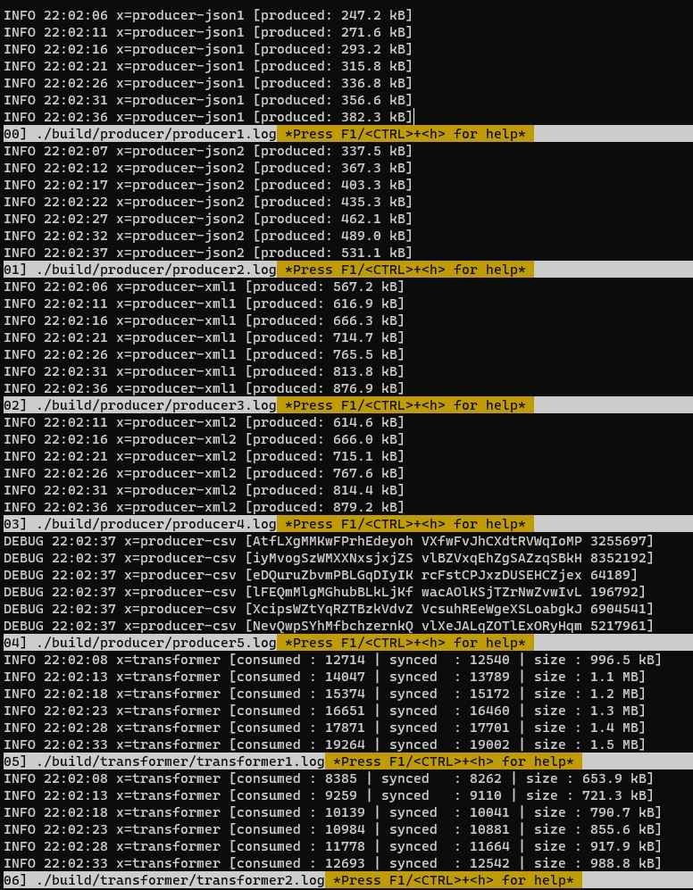

# data-warehouse

### Project Diagram

```shel
// TOPIC: `sdk` PARTITION: 5

     MSA                          kafka consumer group        mysql
+-----------+     +---------+     +-------------------+     +-------+
| producer1 | --> |         | --> | ETL(transformer)1 | --> | RDBMS |
+-----------+     |  kafka  |     +-------------------+     +-------+
     ...          | cluster |              ...                  ^
+-----------+     |   ...   |     +-------------------+         |
| producer2 | --> |         | --> | ETL(transformer)2 | --------+
+-----------+     +---------+     +-------------------+
```


### Dependencies

- dependencies

`apache kafka` `mysql` `protobuf` `docker-compose` `docker` `shell scripts` `make`

- go modules

`github.com/jf-tech/omniparser` `github.com/spf13/cobra` `github.com/Shopify/sarama`

- utils

`multitail`

### Install multitail
```shell
# Ubuntu 
apt install multitail
```

### Install [docker-compose]('https://docs.docker.com/compose/install')
> Require docker installed.
```shell
sudo curl -L "https://github.com/docker/compose/releases/download/1.29.2/docker-compose-$(uname -s)-$(uname -m)" -o /usr/local/bin/docker-compose
sudo chmod +x /usr/local/bin/docker-compose
sudo ln -s /usr/local/bin/docker-compose /usr/bin/docker-compose
```


### Quick Start

#### `make start-test`

```shell
$ make start-test

Removing kafka1    ... done
Removing mysql     ... done
Removing zookeeper ... done
Removing network data-warehouse_default
===> docker-compose up -d ...
Creating network "data-warehouse_default" with the default driver
Creating mysql     ... done
Creating zookeeper ... done
Creating kafka1    ... done
===> wait for docker-compose healthy...
Wait for container 'mysql' to be healthy for max 120 seconds...
Container is healthy after 47 seconds.
===> clean build files...
===> build project...
===> running transformers...
===> running producers...
```

#### `make stop-test`

```shell
$ make stop-test

===> stopping transformers...
===> stopping producers...
Stopping kafka1    ... done
Stopping zookeeper ... done
Stopping mysql     ... done
Removing kafka1    ... done
Removing zookeeper ... done
Removing mysql     ... done
Removing network data-warehouse_default
```

### Test Data

##### json1

```json
{
  "sdkNo": 1,
  "sdkName": "golang"
}
```

##### json2

```json
{
  "ID": "12",
  "name": "golang",
  "ver": "100,000"
}
```

##### xml1

```xml
<sdk>
    <id>165</id>
    <name>golang</name>
    <v>15</v>
</sdk>
```

##### xml2

```xml
<sdk>
    <sdkID>177</sdkID>
    <sdkName>golang</sdkName>
    <sdkVersion>11000</sdkVersion>
</sdk>
```

##### csv

```text
go-lang version 1000
```

##### Formatting Data type

```protobuf
syntax = "proto3";
message Sdk {
    string id = 1;
    string name = 2;
    string version = 3;
}
```

### Test enviroments

| process      | config                           | etc            |
|--------------|----------------------------------|----------------|
| transformer1 | ./configs/transformer_config.json | kafka consumer |
| transformer2 | ./configs/transformer_config.json | kafka consumer |
| producer1    | ./configs/producer_1_config.json | json1          |
| producer2    | ./configs/producer_2_config.json | json2          |
| producer3    | ./configs/producer_3_config.json | xml1           |
| producer4    | ./configs/producer_4_config.json | xml2           |
| producer5    | ./configs/producer_5_config.json | csv            |


### Monitor processes

```shell
$ make multitail
```




### Benchmark testing

```shell
$ make test-benchmark

===> test benchmark...
goos: linux
goarch: amd64
pkg: github.com/minseokoh/data-warehouse/bench
cpu: Intel(R) Core(TM) i5-6500 CPU @ 3.20GHz
BenchmarkSchemas
BenchmarkSchemas-4         51760             21557 ns/op           19707 B/op        129 allocs/op
Benchmark20Schemas
Benchmark20Schemas-4       11122             99762 ns/op          121009 B/op        614 allocs/op
PASS
ok      github.com/minseokoh/data-warehouse/bench   4.401s
```

### Unit testing

```shell
$ make test-unit

===> test omni schemas...
=== RUN   TestJson1
--- PASS: TestJson1 (0.01s)
=== RUN   TestJson2
--- PASS: TestJson2 (0.01s)
=== RUN   TestXml1
--- PASS: TestXml1 (0.01s)
=== RUN   TestXml2
--- PASS: TestXml2 (0.03s)
=== RUN   TestCsv1
--- PASS: TestCsv1 (0.02s)
PASS
ok      github.com/minseokoh/data-warehouse/schema  (cached)
===> test types...
?       github.com/minseokoh/data-warehouse/types   [no test files]
?       github.com/minseokoh/data-warehouse/types/db        [no test files]
=== RUN   TestNewSchemas
--- PASS: TestNewSchemas (0.02s)
PASS
ok      github.com/minseokoh/data-warehouse/types/schema    (cached)
```